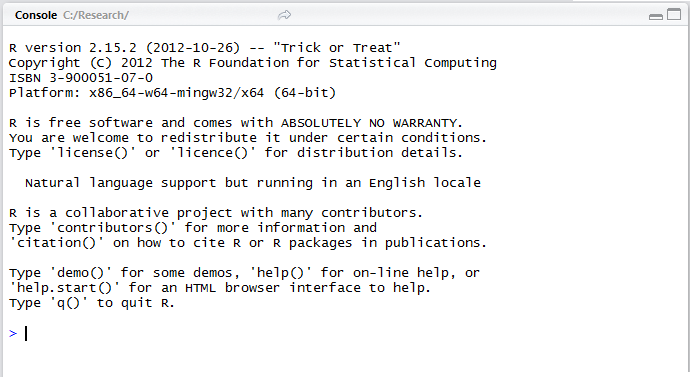
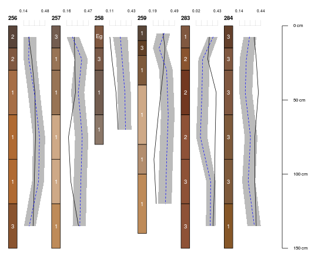
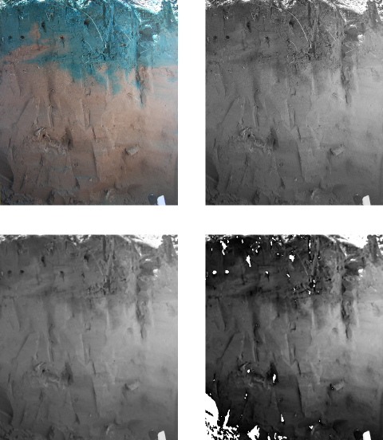
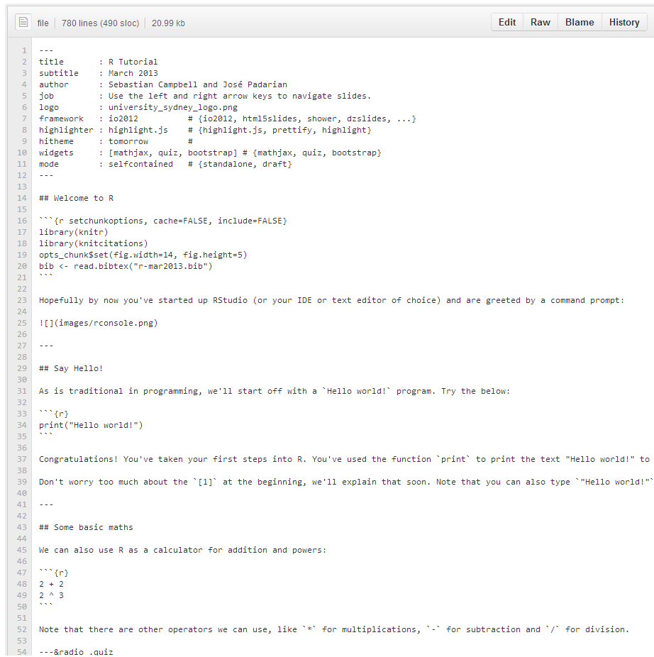

## What is R?

R is an open-source statistical programming language. It is now widely used in both business and academia. It is both powerful and actively developed, so the number of add-on packages for it are constantly increasing.


---

## Why use R for spectroscopy?

* R is free
  * Other spectroscopy software (e.g. Unscrambler) can cost in the vicinity of $6000
  * Other statistical software (SAS, SPSS) can cost around $3500/year
  * These costs make it harder to share your analysis with others
* R is the gift that keeps on giving
  * Not just for spectroscopy: mapping, modelling, 
    data manipulation, web applications...

---

## Welcome to R

```{r setchunkoptions, cache=FALSE, include=FALSE}
library(knitr)
library(knitcitations)

knit_hooks$set(lowuppermargin = function(before, options, envir) {
    if (before) {
        par(mar=c(5, 4, 1, 2) + 0.1)
        }
    }, webgl = hook_webgl)

opts_chunk$set(fig.width=10, fig.height=4, dev="svg", lowuppermargin=TRUE)

bib <- read.bibtex("r-mar2013.bib")
```

Hopefully by now you've started up RStudio (or your IDE or text editor of choice) and are greeted by a command prompt:



---

## Say Hello!

As is traditional in programming, we'll start off with a `Hello world!` program. Try the below:

```{r}
print("Hello world!")
```

Congratulations! You've taken your first steps into R. You've used the function `print` to print the text "Hello world!" to the screen. Functions are basically like verbs in language, they tell R to do something. Notice the brackets `()` after the name of the function in which you can tell the function what to do.

Don't worry too much about the `[1]` at the beginning, we'll explain that soon. Note that you can also type `"Hello world!"` without the `print` command and R will assume you meant to print it.

---

## Some basic maths

We can also use R as a calculator for addition and powers:

```{r}
2 + 2
2 ^ 3
```

Note that there are other operators we can use, like `*` for multiplications, `-` for subtraction and `/` for division. 

---&radio .quiz

## Quick quiz

We'll be having a few quizzes like this during this tutorial. No pressure, it's just to check your understanding. Click 'Submit' to check if your answer is right. If you give up 'Check answer' will give you an answer. 'Clear' will allow you to start that quiz from scratch.

### What is the expected result from `6 / 2`?

1. 1
2. 2
3. _3_
4. 4

*** explanation

It's 3, because $\frac{6}{2} = 3$.

---

## Assigning variables

So now we can do some maths, but we don't want to have to remember the results every time. So let's store some as variable, so we can refer to them by name. To assign, we can use either the `=` or `<-` operator (though `<-` is recommended).

```{r}
core_volume <- 100
core_mass <- 180
bulk_density <- core_mass / core_volume

bulk_density
```

Note that assignment doesn't print the variable to the console.

---

## Not just numbers

R doesn't just work with numbers, it can also work with "strings" or characters. Strings are denoted by the quotes (`""`) surrounding them. We've already used these when we made our "Hello world!" program. In fact, we can use the `paste` function to stick them together. 

```{r}
paste("The bulk density is:", 1.75, sep=" ")
```

The `paste` function sticks strings and numbers together into a single string. The `sep` argument says: "Put a space between all of the things I'm sticking together".

---

## Making readable results

Let's combine all the things we know so far into something useful. Remember the bulk density we calculated earlier?

```{r}
paste("The bulk density is:", bulk_density, sep=" ")
```

Here R evaluated our variable `bulk_density` and added it to the string we were trying to make.

---&radio .quiz

## Quiz 2

### Which of these lines of code will produce the result: `"1:2:3:x:y:z"`

1. _paste(1, 2, 3, "x", "y", "z", sep=":")_
2. paste("123xyz", sep=":")
3. paste(1, 2, 3, x, y, z, sep=":")
4. paste(1, 2, 3, "x", "y", "z")

*** explanation

The first option. The second option won't work as there's only one string, so R can't place separators between strings. The third option is trying to call variables named `x`, `y` and `z` (but it's likely none exist). Finally, the fourth option is space-separated, not colon-separated.

---

## Bigger data

So we've been dealing with individual strings and numbers, let's move onto combining those into vectors. A vector is basically just a 1-dimensional array of data. Like a set of numbers or a shopping list. It's really easy to make vectors of sequential integers:

```{r}
1:10
5:-5
```

---

## More vectors

You can also make vectors of strings or numbers using the combine (`c`) function:

```{r}
c(5, 4, 3, 2, 8)
c("sand", "silt", "clay")
```

---

## Limits of atomic vectors

But be careful. These kinds of vectors can only take one type of data. If you combine numbers and strings together:

```{r}
c("SOILID001", 3, 5, "SOILID006", 7)
```

Then they all become characters.

If you think about it, you can treat numbers as letters, but it's a lot harder to treat letters as numbers.

***pnotes

Try to use the function `list`. With this function you can combine any type of R objects.

```{r}
list('a',c(1,2,3),matrix(1:4,2,2),list(2,'b'))
```

---

## Even bigger data

Now that we can make vectors we can make subsets of bigger datasets, matrices and dataframes. Just to start off, we'll use a simple dataset which comes with R: `trees` (Try `?trees` for more information about the data). It is a data frame, a collection of vectors as columns. The vectors are allowed to be different types (character, integer, numeric), but they must all be the same length.

```{r}
trees
```

---

## Structure of objects

Another way of examining objects is the `str` function

```{r}
str(trees)
```

---

## Summaries

More useful information about the data frame's columns can be obtained using `summary`:

```{r}
summary(trees)
```

---

## Subsetting

The basic form of a subset is `object[whichrows, whichcolumns]`. Leaving an element blank means select all. So for example, to get the third row of `trees`, or the second column:

```{r}
trees[3, ]
trees[, 2]
```

You might have noticed the `[24]` in the second line of `trees[, 2]`. This indicates that the 72 next to it is the 24th element of that vector. There just isn't enough room on the screen to show it all in one line.

---

## Finer subsetting

We can get individual values by setting both rows and columns

```{r}
trees[3, 2]
trees[1, 1]
```

---

## The last elements

And we can also use `nrow` and `ncol` (gets the number of rows or columns) to get the last elements:

```{r}
nrow(trees)
trees[nrow(trees), ]
trees[, ncol(trees)]
```

---

## Why stop at one?

You can also subset collections of elements. To get the fourth to seventh row of the first and third column:

```{r}
trees[4:7, c(1, 3)]
```


---&radio .quiz

## Subsetting quiz

### What is the number in the third last row of the 2nd column of `trees`?

1. _80_
2. 87
3. 65
4. 10.3

***explanation

Using the line `trees[nrow(trees) - 2, 2]` will get you the third last row of the second column. Third last is the last one minus 2 places.

---

## Other ways of extracting columns

Data frames are collections of vectors, so you can use their names to extract them. You can use your original notation and also `$` notation (which is convenient, but not as powerful).

```{r}
trees[, "Height"]
trees$Height
```

---

## Subsetting by a conditional

Often, we want all the rows that meet a certain condition. Say I want all the trees where the height is greater than 82 ft. First, I can produce a TRUE/FALSE variable, then take only the cases where it is true:

```{r}
greater82 <- trees$Height  > 82
greater82[1:5]
trees[greater82, ]
```

---&radio .quiz

## Logical subsetting quiz

### How many trees are there with a girth less than 12.5 inches?

1. 3
2. 8
3. 0
4. _15_

***explanation

Using the code `trees[trees$Girth < 12.5, ]`, we can see that there are `r nrow(trees[trees$Girth < 12.5, ])` trees with a girth less than 12.5. Press 'p' to see the whole expected output.

***pnotes

```{r}
trees[trees$Girth < 12.5, ]
```

---

## Plotting data

A plot is worth a thousand words... R is capable of plotting data in many different ways. Let's start with a basic function, plotting a **histogram**.

```{r}
hist(trees[,2])
```

---

## Making nice plots

Let's use some extra arguments for the function `hist`:

```{r}
hist(trees[, 2], xlab='Height', main='Our first plot!')
```

---

## Box plots

Another simple and useful plot is the box plot. Remember that we can fix up those messy axis labels with the xlab and ylab arguments. We'll use another sample dataset (`CO2`) so remember to check its structure. It's a dataset regarding CO<sub>2</sub> uptake in plants. You can find out more by using `?CO2`

```{r}
boxplot(uptake ~ Plant, data=CO2, xlab='Plant', ylab=expression(CO[2]~'uptake'))
```

***pnotes

Try other combinations like:

```{r,eval=FALSE}
boxplot(uptake ~ Type + Treatment, data=CO2)
```

---

## What happen if our data is not organised as we want?

Let's take a look to the dataset `co2`. This is a different dataset (R is case sensitive) and refers to CO<sub>2</sub> concentrations in ppm in Mauna Loa. Let's modify it into something to work with.

```{r}
data.co2 <- as.data.frame(matrix(co2, ncol=12, byrow=TRUE), row.names=F)
colnames(data.co2) <- month.abb
data.co2$year <- unique(floor(time(co2)))
head(data.co2)
```

---

## Loading in packages

For the next modification we will need to load a new library (and possibly install it!).

```{r,eval=FALSE}
install.packages("reshape2")
library(reshape2)
```
```{r,echo=FALSE}
library(reshape2)
```

R is free and there are many official packages available (check [CRAN](http://cran.r-project.org/web/packages/available_packages_by_name.html), the archive of R packages).

Also many people create their own packages to distribute their work. Many of them are hosted in [github](http://github.com), [R-forge](http://r-forge.r-project.org/) or similar websites. Over the next couple of days you will be using a custom package developed in this department.

---

## Reshaping data

Now we have the reshape2 package loaded in, we can use the `melt` function to melt out data frame. See the `?melt.data.frame` page for details. The `id.vars` are the variables we don't want to melt. The `.name` arguments control the column names of the result:

```{r}
data.co2_melt <- melt(data.co2,id.vars='year',variable.name='month',value.name='co2')
head(data.co2_melt)
```

---

## More plots

Now that we have stacked data, it's much easier to make plots. For example, it's easy to make a simple scatter plot.

```{r}
plot(co2~year,data=data.co2_melt)
```

---

## plyr

Stacking the data has also made our data easier to summarise. We're going to use the `plyr` package. In particular, a function `ddply` Let's start with something simple. Let's get the mean temperature for each year:

```{r}
library(plyr)
year_mean <- ddply(data.co2_melt, c("year"), summarise, meanco2 = mean(co2))
head(year_mean)
```

---

## Plotting summaries

Now we can plot that easily:

```{r}
plot(meanco2~year,data=year_mean)
```

***pnotes

Try how a monthly mean looks like!

```{r,fig.width=9,echo=FALSE}
plot(meanco2~as.numeric(month),data=month_mean)
```

---

## ggplot2

`ggplot2` is a powerful package which allows you to build up complex plots from basic elements.

```{r}
library(ggplot2)
ggplot(data.co2_melt,aes(x=year,y=co2)) + geom_point()
```

---

## Adding some colour

With a few modifications to the original code we can generate a much clearer plot.

```{r}
ggplot(data.co2_melt,aes(x=year,y=co2,colour=month)) + geom_line()
```

---

## More complex plots?

We can go back to our melted data and look at all the concentrations of carbon dioxide over time, for each month using facets.

```{r}
ggplot(data.co2_melt,aes(x=year,y=co2)) + geom_line() + facet_wrap(~month)
```

---

## Linear models

If we want to check the behaviour of the CO<sub>2</sub> concentration over time, we can use the function `lm`

```{r}
model_ <- lm(co2~year,data=data.co2_melt)
model_
```

---

## Getting things out of a linear model

We can access some important information using `summary`

```{r}
summary(model_)
```

---

## SS tables

We can produce familiar tables containing sum of squares and p-values using the `anova` function:

```{r}
anova(model_)
```

---

## Linear models: Plot

Let's plot the previous data and fitted linear model:

```{r}
plot(co2~year,data=data.co2_melt)
abline(model_,col="blue",lwd =2)
```

---

## Linear models: Predicting

What a horrible trend we have there... let's see what would happen up to the year 2020 if we don't do something to change that...

```{r}
predictions <- predict(model_, newdata=data.frame(year=1997:2020))
plot(co2~year, data=data.co2_melt, xlim=c(min(data.co2_melt$year), 2020), 
     ylim=c(min(data.co2_melt$co2), max(predictions)))
points(1997:2020, predictions, col='red')
```

---

## But isn't this a spectroscopy workshop?

Ok, ok... We'll use some spectroscopy data to show you two last tasks you can do with R: loading data files and making your own functions.

### Preparing R session

Let's prepare our session to work with our files:

```{r, eval=FALSE}
getwd()
```

Now set the working directory with the correct path using the function `setwd`. If you are not sure how to do it, you can use the help for that command typing `?setwd`.

```{r, eval=FALSE}
setwd('path to directory')
```

---

## Loading data files

Let's take a look to the next [spectroscopy data](https://raw.github.com/sebastian-c/r-apr2013/gh-pages/spec.zip) (save it in your computer).

If we try directly with the function `read.table`

```{r}
spec_data <- read.table(file='kaolinite_cm9.11962.asc')
```

!!!!

Relax... Let's open the file in an external text editor...

---

## Loading data files

After checking the structure of the file we can use extra arguments for the function `read.table`

```{r}
spec_data <- read.table(file='kaolinite_cm9.11962.asc', skip=16, na.strings = '-1.23e34', col.names = c('wavelength', 'reflectance','sd'))
spec_data$wavelength <- spec_data$wavelength*1000
head(spec_data)
```

---

## Do I have to do this every time?

Often we have to do tedious and repetitive tasks (like the one we just did). In those cases is recommended to create a function to automate this process.

```{r}
read_spec <- function(.spectra_file){
  .data <- read.table(file = .spectra_file, skip=16, na.strings = '-1.23e34', col.names = c('wavelength', 'reflectance','sd'))
  .data[,1] <- .data[,1] * 1000
  .data
}

kaol <- read_spec(.spectra_file='kaolinite_cm9.11962.asc')
head(kaol)
```

---

## What about another file?

If the other files have the same structure, you can keep using that function to read data in.

```{r}
mont <- read_spec(.spectra_file='montmorillonite_sca2.14557.asc')
head(mont,3)
illi <- read_spec(.spectra_file='illite_imt1.10982.asc')
head(illi,3)
```

---

## Fun to look forward to:

When you have a bit more R experience, you can make graphs like the following:

* Web applications
* RGoogleVis
* This presentation
* Soil graphs (from different data)
* Map with points in R
* More!

---

## googleVis

We can make your first plot a lot fancier if we want (hover your mouse over it):

```{r, results='asis', cache=TRUE, echo=FALSE}
suppressPackageStartupMessages(library(googleVis))

soiltempdata <- read.csv("soiltempdata.csv", skip=16, na.strings=c(6999, 7777))

soiltempdata <- transform(soiltempdata, Time=strptime(paste0(Year, "-", Month, "-", Day, " ", sprintf("%02i", Hour), ":00:00"), tz="America/Anchorage", format="%Y-%m-%d %H:%M:%S"))

depths <- paste0(c(0, 5, 10, 15, 20, 40, 60, 80, 100, 120, 135, 150), " cm")
names(soiltempdata)[grep("^Depth", names(soiltempdata))] <- depths

# Remove depth 100 as it's empty
soiltempdata <- soiltempdata[, !grepl("100 cm", names(soiltempdata), fixed=TRUE)]
newdepths <- depths[!grepl("100 cm", depths, fixed=TRUE)]

# names(gvistempdata)[grep("Depth.0.cm", names(gvistempdata), fixed=TRUE)] <- "Temperature"

M <- gvisLineChart(soiltempdata, xvar="Time", yvar=newdepths, options=list(width=1000, height=500, lineWidth=0.5, vAxis="{title:'Temperature'}", hAxis="{title:'Time'}", title="Alaskan surface soil temperature"))

print(M, "chart")
```

---

## Soil profiles

Plot soil profiles with the help of package `aqp`:



---

## Georeferenced data

Plot soil profiles locations:


---

## Images processing



---

## Shiny

<iframe src="http://glimmer.rstudio.com/sebastianc/bulk_density/"></iframe>

---

## Interactive 3D graphs

```{r testgl, webgl=TRUE}
x <- sort(rnorm(1000))
y <- rnorm(1000)
z <- rnorm(1000) + atan2(x,y)
plot3d(x, y, z, col=rainbow(1000))
```
---

## This presentation!

This presentation was entirely made in R using some useful packages such as [slidify](http://slidify.org) `r citep(bib["Vaidyanathan2012"])`. You can look at the source for it on [GitHub](https://github.com/sebastian-c/r-mar2013).



---

## Bibliography

```{r bibliography, echo=FALSE, results='asis'}
bibliography("html")
```
